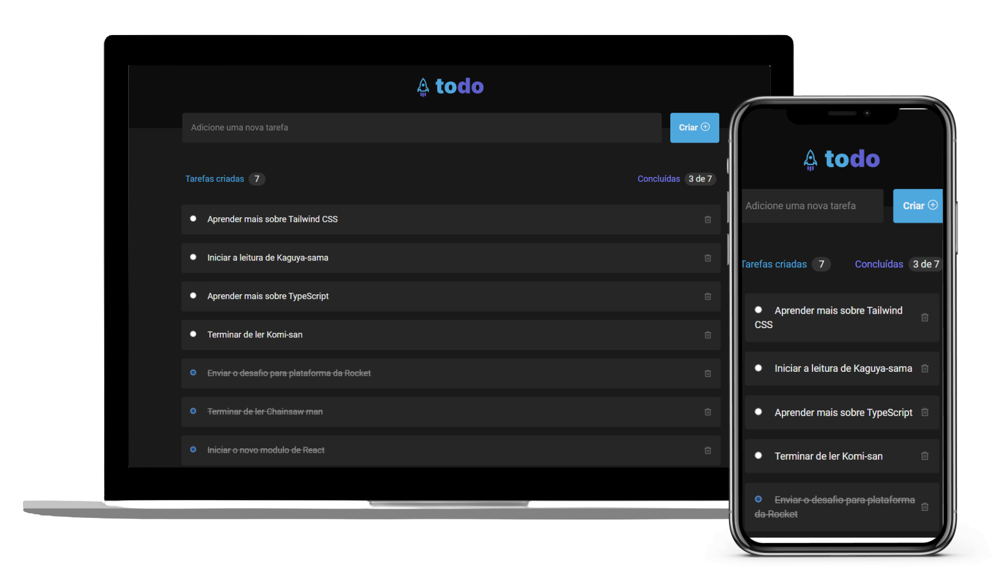

<h1 align="center">
        
</h1>

<p align="center">
  
</p>

<br>

## 💻 Projeto

  TodoList - Desafio do primeiro modulo do ignite.
  <br />
  
  Adicionado - Responsividade.

## 🖼 Layout

Veja o layout no link abaixo:
  - [Feedget - Figma](https://www.figma.com/file/IWS9pU2DO1SBk5XJeeuwWO/ToDo-List)

## :rocket: Tecnologias

Esse projeto foi desenvolvido com as seguintes tecnologias:

- [Vitejs](https://vitejs.dev/)
- [ReactJS](https://reactjs.org)
- [TypeScript](https://www.typescriptlang.org/)
- [Tailwind CSS](https://tailwindcss.com/)


## 🤞 Iniciando o projeto

**Clone o projeto e acesse a pasta**

```bash
git clone https://github.com/vinive/todolist-challenge.git && cd todoChallenge
```

**Siga os passos**

```bash
# Instale as dependências
$ npm install

# Inicie a aplicação
$ npm run dev
```

 
Desenvolvido com 💙 por [Vinicius](https://github.com/vinive) 👻
